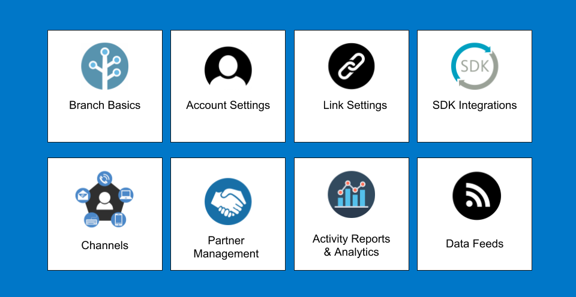

template: main-lp.html

<!--  -->

  <!-- row 1 -->
  

    

      <a href="/pages/resources/basics-overview/">
        
        
Branch Basics

      </a>
      <a href="/pages/dashboard/account-settings/">
        
        
Account Settings

      </a>
      <a href="/pages/links/branch-links-overview/">
        
        
Link Settings

      </a>
    

    

    

      <a href="/pages/resources/native-sdks-and-plugins/">
        
        
Developer Resources

      </a>
      <a href="/pages/resources/branch-channels">
        
        
Channels

      </a>
      <a href="/pages/partner-management/branch-integrated-partners">
        
        
Partner Management

      </a>
    

    

    

      <a href="/pages/dashboard/analytics-overview">
        
        
Activity Reports & Analytics

      </a>
      <a href="/pages/exports/data-feeds-overview">
        
        
Data Feeds

      </a>
    

    

  

  <!-- divider -->
  

  <!-- bottom nav -->
  

    

      <a href="https://support.branch.io/support/solutions/folders/6000232535">
        
        
How To Guides

      </a>
      <a href="https://support.branch.io/support/solutions/folders/6000232536">
        
        
Troubleshooting

      </a>
      <a href="https://support.branch.io/support/solutions/folders/6000232748">
        
        
Product Updates

      </a>
    

    

    

      <a href="https://support.branch.io/support/solutions/folders/6000232721">
        
        
Best Practices

      </a>
    

  

  

  <!--/bottom-nav-->

